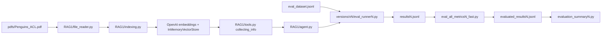
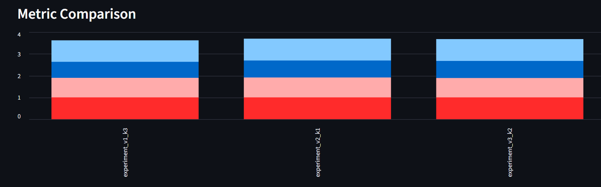

# LLM Evaluation System

> A compact evaluation lab for one RAG pipeline: ask questions about a penguin PDF, score the answers with DeepEval, and compare saved evaluation runs.


This project evaluates a single LangChain RAG pipeline against 20 question-and-answer pairs about [`pdfs/Penguins_ACL.pdf`](pdfs/Penguins_ACL.pdf). The only active RAG implementation is [`RAG1/`](RAG1/); the [`versions/`](versions/) folders are saved evaluation runs and scripts for that same pipeline.


## Contents

- [Current Structure](#current-structure)
- [Saved Results](#saved-results)
- [How It Works](#how-it-works)
- [Evaluation Metrics](#evaluation-metrics)
- [Get Started](#get-started)
- [Run Evaluations](#run-evaluations)
- [Dashboard](#dashboard)
- [Project Map](#project-map)
- [Practical Notes](#practical-notes)

## Current Structure

The project is now organized around these pieces:

| Path | Role |
|---|---|
| [`RAG1/`](RAG1/) | The only active RAG implementation |
| [`pdfs/Penguins_ACL.pdf`](pdfs/Penguins_ACL.pdf) | Source document used for retrieval |
| [`eval_dataset.jsonl`](eval_dataset.jsonl) | 20 evaluation questions with expected answers |
| [`versions/v1/`](versions/v1/), [`versions/v2/`](versions/v2/), [`versions/v3/`](versions/v3/) | Saved evaluation runs plus runner, scorer, and summary scripts |
| [`single_tests/`](single_tests/) | Small DeepEval examples for one metric at a time |
| [`experiment_v1.jsonl`](experiment_v1.jsonl), [`experiment_v2.jsonl`](experiment_v2.jsonl), [`experiment_v3.jsonl`](experiment_v3.jsonl) | Root-level evaluation summaries |
| [`dashboard.py`](dashboard.py) | Streamlit dashboard for the three root-level evaluation summaries |

The `versions/vN` folders are not separate RAG implementations. Each runner imports the same [`RAG1.agent.ask`](RAG1/agent.py) function; only the saved run outputs and script names differ.

## Saved Results

The root evaluation summaries contain one JSON object each, despite the `.jsonl` extension. These are the checked-in averages over 20 cases:

| Summary file | Run label | Saved retriever `k` | Answer relevancy | Faithfulness | Context relevancy | Correctness |
|---|---|---:|---:|---:|---:|---:|
| [`experiment_v1.jsonl`](experiment_v1.jsonl) | `experiment_v1_k3` | 3 | 0.988 | 1.000 | 0.733 | 0.900 |
| [`experiment_v2.jsonl`](experiment_v2.jsonl) | `experiment_v2_k1` | 3 | 1.000 | 1.000 | 0.781 | 0.915 |
| [`experiment_v3.jsonl`](experiment_v3.jsonl) | `experiment_v3_k2` | 3 | 1.000 | 1.000 | 0.787 | 0.890 |

These are saved snapshots, not guaranteed reproducible scores. DeepEval metrics use LLM judges, so reruns can vary. The dashboard displays the run labels and `retriever_k` values exactly as stored in these summary files.

## How It Works



The live RAG path:

1. [`RAG1/file_reader.py`](RAG1/file_reader.py) extracts text blocks from the PDF with PyMuPDF.
2. [`RAG1/indexing.py`](RAG1/indexing.py) embeds those chunks with `text-embedding-3-large` and stores them in a LangChain `InMemoryVectorStore`.
3. [`RAG1/tools.py`](RAG1/tools.py) exposes a retrieval tool called `collecting_info`.
4. [`RAG1/agent.py`](RAG1/agent.py) builds a LangChain agent with `gpt-4o`, calls the retrieval tool, and returns a structured `answer` plus `context`.
5. The evaluation runner scripts call the same RAG over all 20 dataset rows and save JSONL output.

## Evaluation Metrics

| Metric | DeepEval implementation | What it checks | Main inputs |
|---|---|---|---|
| Answer relevancy | `AnswerRelevancyMetric` | Whether the answer addresses the question | Question, actual answer |
| Faithfulness | `FaithfulnessMetric` | Whether the answer is supported by the supplied context | Actual answer, retrieval context |
| Context relevancy | `ContextualRelevancyMetric` | Whether the retrieved context is useful for the question | Question, retrieval context |
| Correctness | `GEval` | Whether the answer is factually correct against the expected answer | Actual answer, expected answer |

The metric scripts use a `0.7` threshold. The `*_fast.py` scripts batch the evaluation through `deepeval.evaluate(...)` and write the scored JSONL files.

## Get Started

### Requirements

| Requirement | Why |
|---|---|
| Python 3.12+ | Required by [`pyproject.toml`](pyproject.toml) |
| `uv` | Installs and runs the locked environment |
| OpenAI API key | Needed for embeddings, answer generation, and DeepEval judge calls |

Install dependencies from the repository root:

```bash
uv sync
```

To inspect a saved run without making API calls:

```bash
cd versions/v2
uv run python evaluation_summary2.py
cd ../..
```

Repeat the same pattern in `versions/v1` or `versions/v3` to summarize another saved run.

## Run Evaluations

Create a `.env` file in the repository root:

```env
OPENAI_API_KEY=your_openai_api_key_here
```

Run a single metric example:

```bash
uv run --env-file .env python single_tests/test_single_eval_answer_relevancy.py
uv run --env-file .env python single_tests/test_single_eval_faithfulness.py
uv run --env-file .env python single_tests/test_single_eval_context_relevancy.py
uv run --env-file .env python single_tests/test_single_eval_correctness.py
```

Run all 20 cases with one of the saved-run script sets from the repository root:

```bash
uv run --env-file .env python versions/v3/eval_runner3.py
uv run --env-file .env python versions/v3/eval_all_metrics3_fast.py
uv run python versions/v3/evaluation_summary3.py
```

Change the folder and filename number to use the `v1`, `v2`, or `v3` script set. These scripts all call the same `RAG1` pipeline. When the commands are started from the repository root, the generated `resultsN.jsonl` and `evaluated_resultsN.jsonl` files are written to the root directory. The checked-in saved copies live under `versions/vN/`.

To test a different retrieval size, edit the `k` value in [`RAG1/tools.py`](RAG1/tools.py):

```python
docs = vectore_store.similarity_search(query, k=2)
```

Then rerun the runner, scorer, and summary scripts. Update the evaluation summary label so it matches the setting you actually ran.

## Dashboard

The Streamlit dashboard reads the three root summaries directly:

| File | Displayed as |
|---|---|
| [`experiment_v1.jsonl`](experiment_v1.jsonl) | `experiment_v1_k3` |
| [`experiment_v2.jsonl`](experiment_v2.jsonl) | `experiment_v2_k1` |
| [`experiment_v3.jsonl`](experiment_v3.jsonl) | `experiment_v3_k2` |

Run it from the repository root:

```bash
uv run streamlit run dashboard.py
```

The first view shows all saved evaluation runs and their four metric averages:


The metric comparison chart stacks the four scores for each run:



Use the run inspector to focus on one saved run at a time:


The final table highlights the best saved run for each metric:


## Project Map

| Path | Purpose |
|---|---|
| [`RAG1/agent.py`](RAG1/agent.py) | LangChain agent and `ask(question)` entry point |
| [`RAG1/tools.py`](RAG1/tools.py) | Retrieval tool and active `k` setting |
| [`RAG1/indexing.py`](RAG1/indexing.py) | PDF chunk embedding and in-memory vector store setup |
| [`RAG1/file_reader.py`](RAG1/file_reader.py) | PDF text extraction helper |
| [`RAG1/prompts.py`](RAG1/prompts.py) | System prompt for the RAG assistant |
| [`RAG1/objects.py`](RAG1/objects.py) | Pydantic response schema |
| [`versions/v1/`](versions/v1/) | First saved evaluation run: runner, metric scripts, scored results, summary |
| [`versions/v2/`](versions/v2/) | Second saved evaluation run: runner, metric scripts, scored results, summary |
| [`versions/v3/`](versions/v3/) | Third saved evaluation run: runner, metric scripts, scored results, summary |
| [`single_tests/`](single_tests/) | Standalone DeepEval metric demos |
| [`compare_experiments.py`](compare_experiments.py) | Helper script with hard-coded comparison filenames |
| [`save_experiment.py`](save_experiment.py) | Helper script for writing an evaluation summary from evaluated results |
| [`main.py`](main.py) | Placeholder entry point |

## Practical Notes

- The dataset is intentionally small and centered on one PDF, so treat the results as an evaluation-design exercise rather than a broad benchmark.
- The vector store is in memory and is rebuilt when [`RAG1/indexing.py`](RAG1/indexing.py) is imported.
- The runner scripts call OpenAI for embeddings and answer generation; the metric scripts call DeepEval judges. These runs can take time and may incur API costs.
- Several helper scripts use hard-coded filenames. Check the input and output paths before using them for a new evaluation run.
