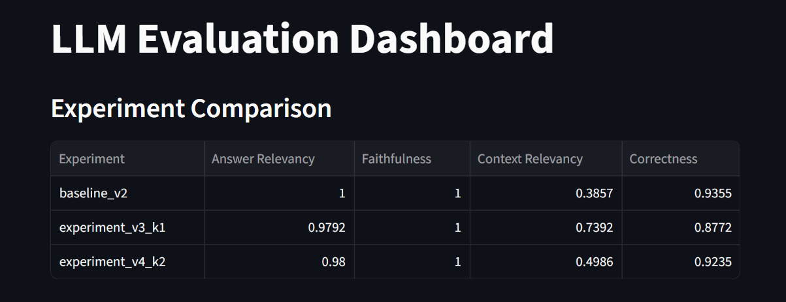
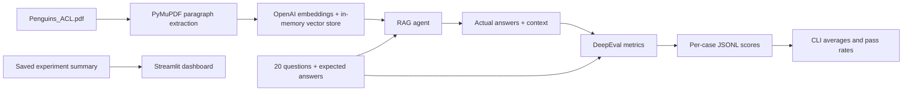
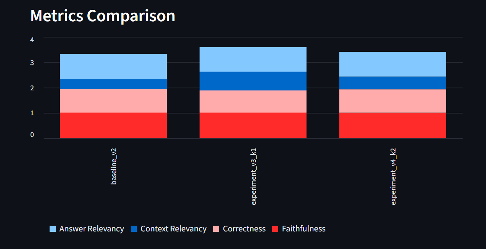
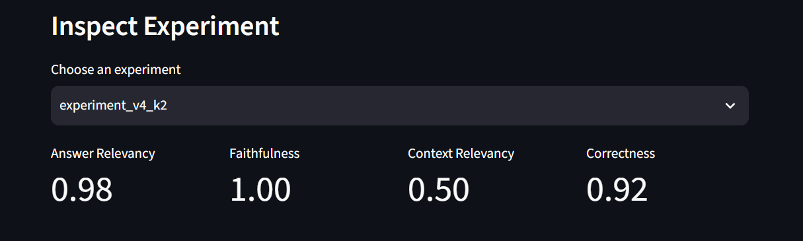

# LLM Evaluation System

> A hands-on RAG evaluation lab: ask questions about a PDF, score the answers with DeepEval, and compare what changes when retrieval returns one, two, or three passages.


This repository follows **20 question-and-answer pairs** about a penguin PDF through retrieval, answer generation, per-case evaluation, and experiment comparison. The committed results and dashboard let you explore the findings before making any API calls.



## Contents

- [What you will learn](#what-you-will-learn)
- [Results](#results)
- [How it works](#how-it-works)
- [Evaluation metrics](#evaluation-metrics)
- [Get started](#get-started)
- [Run your own evaluations](#run-your-own-evaluations)
- [Explore the dashboard](#explore-the-dashboard)
- [Project map](#project-map)
- [Teaching path](#teaching-path)
- [Practical notes](#practical-notes)

## What You Will Learn

- Build evaluation cases from a question, an expected answer, the model's actual answer, and the passages it retrieved.
- Separate answer quality from retrieval quality with four DeepEval metrics.
- See why evaluating a model-written citation is different from evaluating the passages the retriever actually returned.
- Change the retriever's `k` value and inspect the effect on context relevance and answer correctness.
- Move from individual JSONL scores to averages, pass rates, and a visual experiment comparison.

## Results

These are the **saved averages over 20 questions** in [`experiments_summary.json`](full_criteria_testing/experiments_summary.json). Higher scores are better; this is one recorded run, not a guarantee that the same settings will win on another dataset or judge run.

| Experiment | Retrieved passages (`k`) | Answer relevancy | Faithfulness | Context relevancy | Correctness |
|---|---:|---:|---:|---:|---:|
| `baseline_v2` | 3 | **1.000** | 1.000 | 0.386 | **0.935** |
| `experiment_v3_k1` | 1 | 0.979 | 1.000 | **0.739** | 0.877 |
| `experiment_v4_k2` | 2 | 0.980 | 1.000 | 0.499 | 0.924 |

In this snapshot, retrieving one passage produces the most relevant context, while retrieving three has the highest correctness score. That trade-off is the point of the lab: look at *which* metric moved, then inspect the underlying cases before choosing a setting.

The earlier `v1` result is kept as a teaching example, but is not in this comparison. Its `context` field comes from the model's structured answer; `v2` and later record the **actual retrieved passages**. That change makes the retrieval-side metrics more meaningful.

## How It Works



The agent uses `gpt-4o` to answer questions and `text-embedding-3-large` to index paragraphs from [`Penguins_ACL.pdf`](RAG/pdfs/Penguins_ACL.pdf). Each RAG variant rebuilds an in-memory vector store when imported. All four variants use the same PDF and question set.

| Version | Agent | Retrieval | Context recorded for evaluation |
|---|---|---:|---|
| `v1` | [`RAG/`](RAG/) | `k=3` | Model-written `context` string |
| `v2` | [`RAG2/`](RAG2/) | `k=3` | List of retrieved passages |
| `v3` | [`RAG3/`](RAG3/) | `k=1` | List of retrieved passages |
| `v4` | [`RAG4/`](RAG4/) | `k=2` | List of retrieved passages |

## Evaluation Metrics

| Metric in this project | DeepEval implementation | What it asks | Main inputs |
|---|---|---|---|
| Answer relevancy | `AnswerRelevancyMetric` | Does the answer address the question? | Question, actual answer |
| Faithfulness | `FaithfulnessMetric` | Is the answer supported by the retrieved passages? | Actual answer, retrieved context |
| Context relevancy | `ContextualRelevancyMetric` | Are the retrieved passages useful for the question? | Question, retrieved context |
| Correctness | Custom `GEval` criterion | Is the answer factually correct relative to the expected answer? | Actual answer, expected answer |

The first three metrics are configured with a `0.7` threshold. The summary scripts use `0.7` to calculate pass rates for **all four** scores. `GEval` is an LLM-judged comparison, not a string match.

The data moves through three simple formats:

| Stage | Example file | Contents |
|---|---|---|
| Evaluation set | [`eval_dataset.jsonl`](data/orginial_Q_A/eval_dataset.jsonl) | One `question` and `expected_answer` per line |
| RAG output | [`results2.jsonl`](full_criteria_testing/v2/results2.jsonl) | Adds `actual_answer` and a `context` list of retrieved passages |
| Scored output | [`evaluated_results2.jsonl`](full_criteria_testing/v2/evaluated_results2.jsonl) | Adds the four numeric metric scores to each case |

## Get Started

### Prerequisites

| Requirement | Why |
|---|---|
| Python 3.12+ | Required by `pyproject.toml` |
| `uv` | Installs and runs the locked Python environment (`pip install uv` if needed) |
| OpenAI API key | Needed only when generating answers, embeddings, or new DeepEval scores |

1. [Fork this repository](https://github.com/Mohamad-Hachem/LLM_Evaluation_System/fork), then clone your fork:

   ```bash
   git clone https://github.com/<your-username>/LLM_Evaluation_System.git
   cd LLM_Evaluation_System
   ```

2. Install the dependencies:

   ```bash
   uv sync
   ```

3. Explore the included results without an API key. **From the repository root:**

   ```bash
   cd full_criteria_testing
   uv run streamlit run ../dashboard.py
   ```

   Open the local URL printed by Streamlit. Run it from `full_criteria_testing/` because [`dashboard.py`](dashboard.py) reads `experiments_summary.json` from the current working directory.

For a terminal summary of a saved experiment, run `python evaluation_summary2.py` from `full_criteria_testing/v2/`. The versioned summary scripts use only the committed scored JSONL files and Python's standard library.

## Run Your Own Evaluations

These steps call OpenAI for embeddings, answers, and/or evaluation judgments, so they may take time and incur API charges.

### 1. Configure your key

Create a `.env` file in the repository root:

```env
OPENAI_API_KEY=your_openai_api_key_here
```

The repository ignores `.env`. The commands below use `uv run --env-file .env` so both the RAG code and DeepEval can see the key.

### 2. Score one example

From the repository root:

```bash
uv run --env-file .env python single_criteria_testing/test_single_eval.py
```

This prints the answer relevancy score, the judge's reason, and whether the `0.7` threshold passed. [`single_criteria_testing/`](single_criteria_testing/) also contains standalone faithfulness and context relevancy examples.

### 3. Run all 20 cases

Start with `v2`, the `k=3` baseline that stores actual retrieved passages. **Run every command from the repository root**; the scripts use paths relative to the current working directory.

```bash
cp data/orginial_Q_A/eval_dataset.jsonl eval_dataset.jsonl
uv run --env-file .env python -m full_criteria_testing.v2.eval_runner2
uv run --env-file .env python -m full_criteria_testing.v2.eval_all_metrics2
uv run python -m full_criteria_testing.v2.evaluation_summary2
```

`cp` works in Bash and PowerShell. This run writes `results2.jsonl` and `evaluated_results2.jsonl` to the repository root. The runner generates answers first; the scorer then evaluates those saved answers; the summary reports averages and pass rates.

To repeat the experiment, use the corresponding modules in `full_criteria_testing/v1/`, `v3/`, or `v4/`. Their runner, scorer, and summary filenames follow the same pattern (`eval_runner3.py`, `eval_all_metrics3.py`, `evaluation_summary3.py` for `v3`, for example). Keep the same evaluation set when comparing variants.

## Explore the Dashboard

The dashboard compares the three experiments with real retrieved context (`v2` to `v4`). Its chart makes the change in context relevancy across `k` values easy to spot:



Select an experiment to inspect its four average scores:



The dashboard reads the **committed snapshot** in [`full_criteria_testing/experiments_summary.json`](full_criteria_testing/experiments_summary.json). Running a new evaluation creates JSONL files but does not update that dashboard file automatically. Add your new experiment's averaged metrics to the summary JSON to display it.

## Project Map

| Path | Purpose |
|---|---|
| [`RAG/`](RAG/), [`RAG2/`](RAG2/), [`RAG3/`](RAG3/), [`RAG4/`](RAG4/) | PDF extraction, embedding index, retrieval tool, prompt, and answer agent for each version |
| [`data/orginial_Q_A/eval_dataset.jsonl`](data/orginial_Q_A/eval_dataset.jsonl) | The 20-question evaluation set (directory spelling is preserved from the repository) |
| [`single_criteria_testing/`](single_criteria_testing/) | Small scripts for learning one DeepEval metric at a time |
| [`full_criteria_testing/`](full_criteria_testing/) | Versioned runs, scored JSONL artifacts, experiment JSON, and summaries |
| [`dashboard.py`](dashboard.py) | Streamlit comparison and experiment inspector |
| [`screenshots/`](screenshots/) | Dashboard screenshots used in this README |
| [`pyproject.toml`](pyproject.toml), [`uv.lock`](uv.lock) | Python requirements and dependency lockfile |

## Teaching Path

1. **Read one test case.** Start with the question and expected answer in the dataset, then inspect its actual answer and retrieved passages in `v2/results2.jsonl`.
2. **Judge one dimension.** Run a script in `single_criteria_testing/`, read the score and reason, and discuss what that metric does not tell you.
3. **Audit the evidence.** Compare `v1`'s model-written `context` with `v2`'s actual retrieved passages. Identify which one is suitable for evaluating retrieval.
4. **Change one variable.** Compare `k=3`, `k=1`, and `k=2`; inspect low-scoring rows instead of relying only on averages.
5. **Design the next experiment.** Change a retriever setting, prompt, or evaluation case; run the same metrics and record a new summary alongside the baseline.

## Practical Notes

- The dataset is deliberately small and covers one PDF. Treat these scores as an exercise in evaluation design, not a broad benchmark.
- RAG indexing is in memory and runs on import. Each fresh run embeds the PDF again.
- The model and embedding names are set in the RAG source files; changing them changes the experiment.
- [`RAG3/agent.py`](RAG3/agent.py) calls `ask(...)` at import time, so a `v3` runner currently makes one extra example request before processing the dataset.
- [`main.py`](main.py) is a placeholder. Use the evaluation scripts and Streamlit command above as the working entry points.
